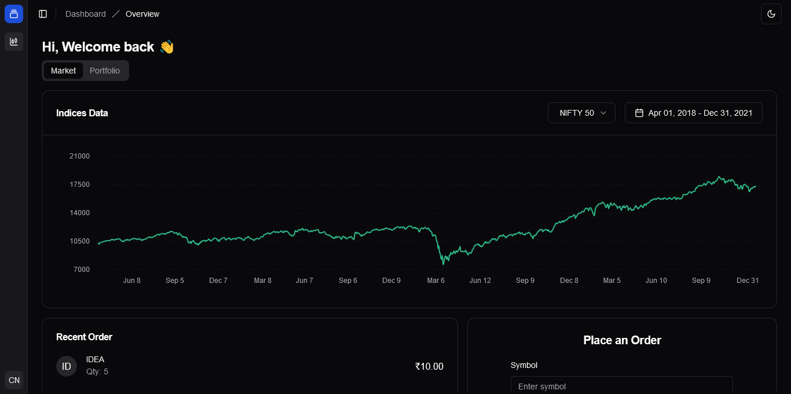

<h1 align="center">
  <br>
  TradeView Frontend
  <br>
</h1>

<h4 align="center">NextJS 15 + Typescript + Tailwind + ShadCN UI + Zod</h4>

<p align="center">
  <a href="#key-features">Key Features</a> •
  <a href="#how-to-use">How To Use</a> •
  <a href="#credits">Credits</a> •
  <a href="#license">License</a>
</p>



## Key Features

- Websocket for Data Streaming of Indices
- Beautiful charts and UI
- Form validation using Zod
- Server side components for perfomance

## To Improve

- Use Hashmap to cache data of Indices and local checks to see if data exists already before requesting new data
- Use state managment
- Security parts of cookies
- Add Zoomable parts in chart

## How To Use

To clone and run this application, you'll need [Git](https://git-scm.com) and [Node.js](https://nodejs.org/en/download/) (which comes with [npm](http://npmjs.com)) installed on your computer. From your command line:

```bash
# Clone this repository
$ git clone https://github.com/kunalagra/tradeview-fe

# Go into the repository
$ cd tradeview-fe

# Rename .env.example to .env
$ mv env.example .env

# Install dependencies
$ npm install

# Run the app
$ npm run dev
```

> [!IMPORTANT]  
> Populate your .env keys with their respective values.

> [!NOTE]
> If you're using Linux Bash for Windows, [see this guide](https://www.howtogeek.com/261575/how-to-run-graphical-linux-desktop-applications-from-windows-10s-bash-shell/) or use `node` from the command prompt.

## Credits

This software uses the following packages:

- [Node.js](https://nodejs.org/)
- [NextJS](https://github.com/vercel/next.js/)
- [ShadCN UI](https://ui.shadcn.com/)

## You may also like...

- [Codegamy](https://github.com/kunalagra/codegamy) - An AIO Medical platform to connect doctors and patients
- [Sikho](https://github.com/kunalagra/sikho) - Professional Learning Marketplace

## License

AGPL-3
